# IEEE-Front
Para poder descargar el proyecto, es necesario abrir una ventana de cmd: 
        Se deberá pulsar el atajo de teclas:
            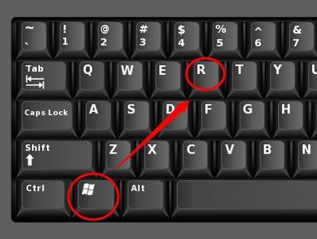

Una vez que se tiene ese comando, aparecerá una ventana emergente a la cual le debera escribir:
            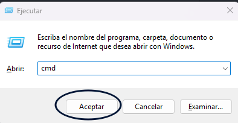

Dentro del cmd, deberá ubicarse en un directorio/Carpeta que sea reconocible por usted:
           Ej: 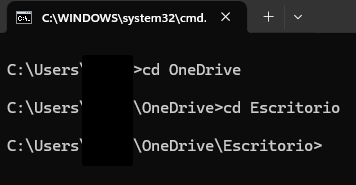

Una vez que usted se encuentre en el directorio deseado, deberá de ejecutar el siguiente comando:
            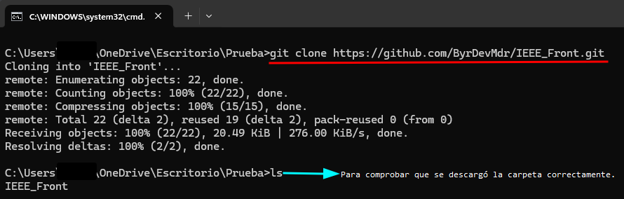                
    
# Presentación del proyecto 

1- En la parte superior derecha, se encuentra un botón que al darle click, se
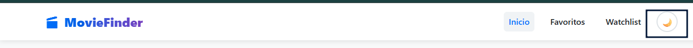

2- Para la busqueda, se deberá poner el nombre en el buscador:
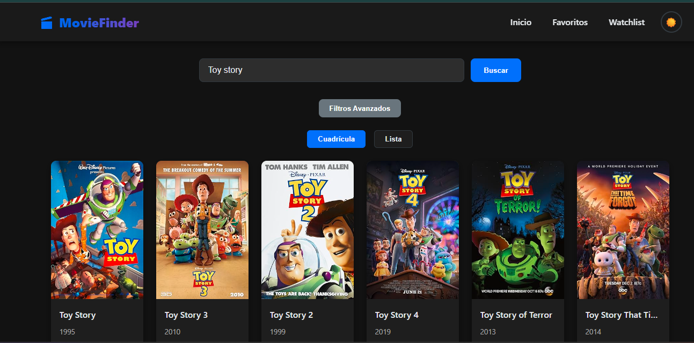

3- Para poder ver los detalles de la pelicula, se deberá de dar click sobre la tarheta de la película.
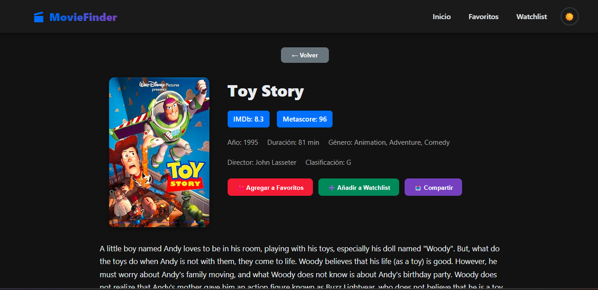

4- Para añadir a los favoritos, se deberá de dar click sobre el botón para ello.

5- Las peliculas marcadas como favoritas, se mostraran en el menú de favoritos.
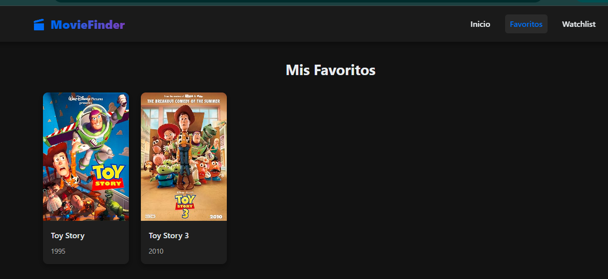

6- Las peliculas marcadas con el watch-list, se mostraran en el menú de watsh-list.
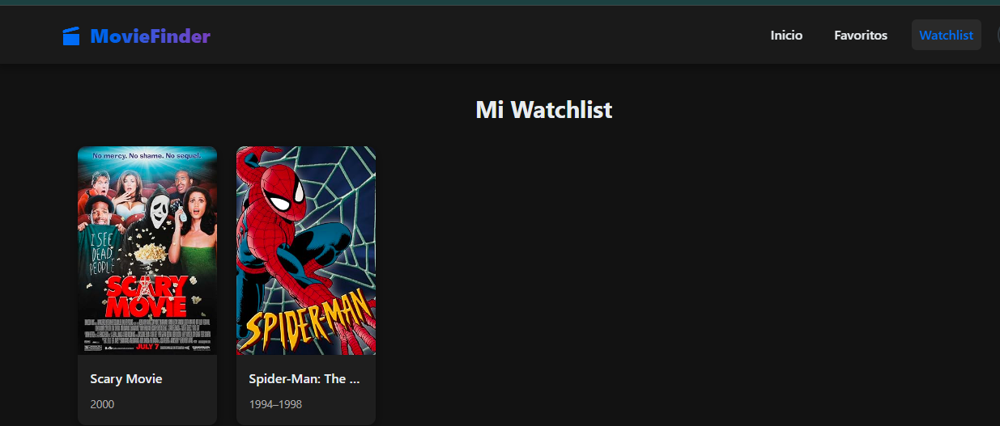

7- Cuando se desee compartir una pelicu la, se deberá dar click al botón de compartir.
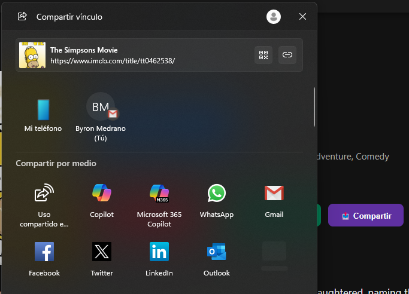

8- Para quitar de favoritos, se agregará un botón dentro del menú.
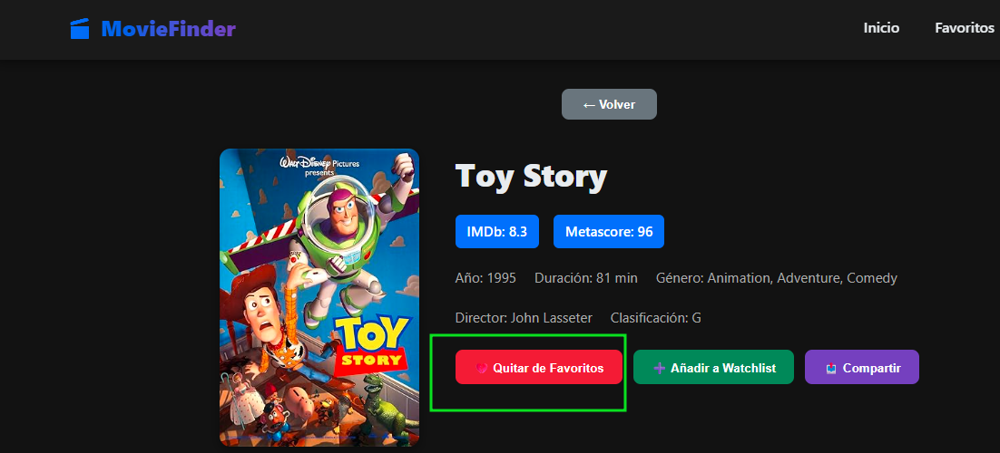
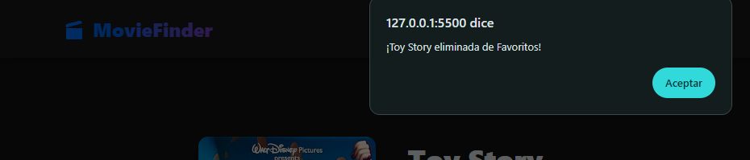

9- Mismo caso para la opcion del watch list.
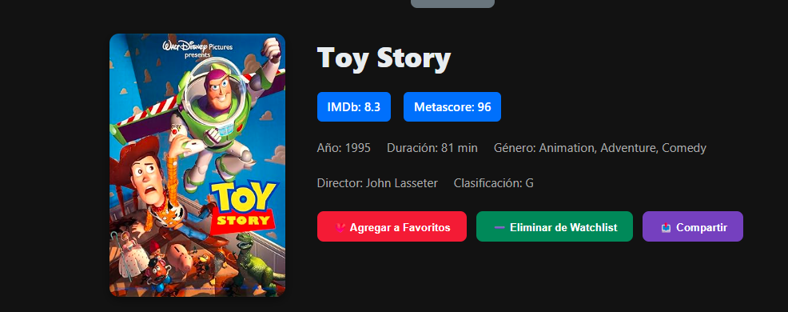
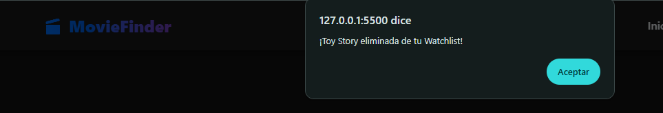

# Tecnologías usadas:
* HTML y CSS

* Vanilla JS

* OMDb API
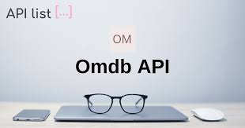